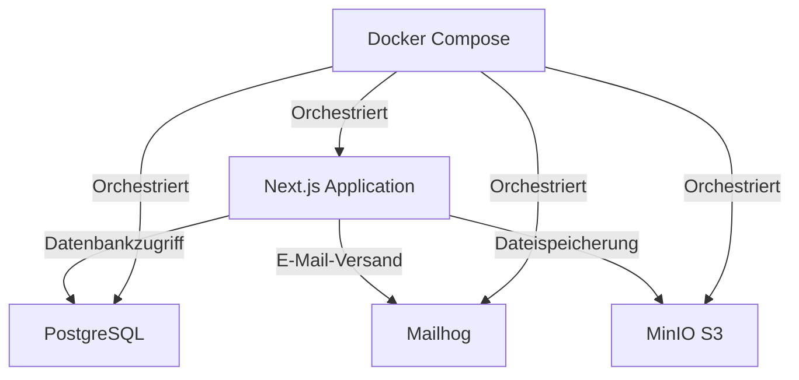

# Entwicklung eines webbasierten Tools zur Automatisierung der Erfassung und Abrechnung von Auslagen und Reisekosten

## Berufsausbildungsabschlussarbeit

**Vorgelegt von:** Georgi Semov  
**Ausbildungsberuf:** Fachinformatiker Fachrichtung Anwendungsentwicklung  
**Ausbildungsbetrieb:** Reedu GmbH & Co. KG  
**Datum:** [Aktuelles Datum]

---

## Inhaltsverzeichnis

1. [Einleitung](#1-einleitung)
2. [Projektübersicht](#2-projektübersicht)
3. [Ist-Zustand Analyse](#3-ist-zustand-analyse)
4. [Anforderungsanalyse](#4-anforderungsanalyse)
5. [Technologiestack](#5-technologiestack)
6. [Systemarchitektur](#6-systemarchitektur)
7. [Implementierung](#7-implementierung)
8. [Sicherheit und Authentifizierung](#8-sicherheit-und-authentifizierung)
9. [Containerisierung und Deployment](#9-containerisierung-und-deployment)
10. [Testing und Qualitätssicherung](#10-testing-und-qualitätssicherung)
11. [Projektverlauf](#11-projektverlauf)
12. [Fazit und Ausblick](#12-fazit-und-ausblick)
13. [Literaturverzeichnis](#13-literaturverzeichnis)
14. [Anhang](#14-anhang)

---

### 1. Einleitung

1.1. Kontext und Motivation des Projekts

In der heutigen digitalisierten Geschäftswelt ist die effiziente Verwaltung von Unternehmensressourcen von entscheidender Bedeutung. Ein Bereich, der oft übersehen wird, aber erhebliches Optimierungspotenzial bietet, ist die Erfassung und Abrechnung von Auslagen und Reisekosten. Die Reedu GmbH & Co. KG, ein innovatives Unternehmen mit weniger als fünfzehn Mitarbeitenden, steht vor der Herausforderung, diesen Prozess zu modernisieren und zu automatisieren.

Die Motivation für dieses Projekt entstand aus der Erkenntnis, dass der bisherige analoge Prozess nicht nur zeitaufwendig und fehleranfällig ist, sondern auch die Effizienz und Transparenz im Unternehmen beeinträchtigt. Insbesondere für ein Unternehmen, das an mehreren öffentlich geförderten Forschungsprojekten beteiligt ist, ist eine präzise und nachvollziehbare Kostenverfolgung von großer Bedeutung.

Ziel dieses Projekts ist es daher, ein maßgeschneidertes, webbasiertes Tool zu entwickeln, das den gesamten Prozess der Auslagen- und Reisekostenabrechnung digitalisiert und automatisiert. Dieses Tool soll nicht nur den administrativen Aufwand reduzieren, sondern auch die Genauigkeit der Abrechnungen verbessern und die Transparenz für alle Beteiligten erhöhen.

1.2. Probleme des aktuellen analogen Prozesses

Der aktuelle analoge Prozess zur Erfassung und Abrechnung von Auslagen und Reisekosten bei der Reedu GmbH & Co. KG weist mehrere Schwachstellen auf, die die Effizienz und Genauigkeit beeinträchtigen:

1. **Zeitaufwand**: Mitarbeitende müssen Formulare manuell ausfüllen und physische Belege sammeln, was zeitraubend ist und von ihrer eigentlichen Arbeit ablenkt.

2. **Fehleranfälligkeit**: Manuelle Dateneingaben und Berechnungen führen häufig zu Fehlern, die zeitaufwendige Korrekturen erfordern.

3. **Mangelnde Transparenz**: Der aktuelle Status einer Abrechnung ist für Mitarbeitende nicht einsehbar, was zu Unsicherheiten und häufigen Nachfragen führt.

4. **Ineffiziente Kommunikation**: Rückfragen und Korrekturen werden meist per E-Mail oder Telefon geklärt, was den Prozess weiter verlangsamt.

5. **Physische Dokumentenverwaltung**: Die Aufbewahrung und Archivierung physischer Belege verursacht zusätzliche Kosten und Aufwand.

6. **Verzögerungen im Genehmigungsprozess**: Die manuelle Weiterleitung von Dokumenten zur Genehmigung durch Vorgesetzte kann zu Verzögerungen führen.

7. **Ineffiziente Buchhaltung**: Die Buchhaltung muss Belege im Nachhinein digitalisieren und manuelle Berechnungen durchführen, was zusätzlichen Arbeitsaufwand bedeutet.

8. **Mangelnde Standardisierung**: Insbesondere für öffentlich geförderte Forschungsprojekte fehlt ein standardisierter Prozess zur Ausgabenerfassung und -berichterstattung.

Diese Probleme verdeutlichen die Notwendigkeit einer digitalen Lösung, die den gesamten Prozess der Auslagen- und Reisekostenabrechnung optimiert und automatisiert. Das zu entwickelnde webbasierte Tool zielt darauf ab, diese Herausforderungen zu adressieren und eine effizientere, genauere und transparentere Abwicklung zu ermöglichen.

### 2. Projektübersicht

2.1. Hauptziele des Projekts

Das Hauptziel dieses Projekts ist die Entwicklung eines webbasierten Tools zur Automatisierung der Erfassung und Abrechnung von Auslagen und Reisekosten für die Reedu GmbH & Co. KG. Im Einzelnen verfolgt das Projekt folgende spezifische Ziele:

1. **Digitalisierung des Erfassungsprozesses**:

   - Implementierung einer benutzerfreundlichen Oberfläche zur digitalen Erfassung von Auslagen und Reisekosten.
   - Integration einer Funktion zum Hochladen und Verwalten digitaler Belege (Scans oder Fotos).

2. **Automatisierung des Abrechnungsprozesses**:

   - Entwicklung eines Systems zur automatischen Weiterleitung von Abrechnungen zur Genehmigung.
   - Implementierung automatisierter Validierungs- und Berechnungsfunktionen.

3. **Erhöhung der Transparenz**:

   - Einführung eines Tracking-Systems, das den aktuellen Status jeder Abrechnung für alle Beteiligten sichtbar macht.

4. **Verbesserung der Datensicherheit**:

   - Implementierung eines sicheren Authentifizierungssystems.
   - Gewährleistung einer sicheren Speicherung und Archivierung aller Daten unter Berücksichtigung der Datenschutzanforderungen.

5. **Optimierung für öffentlich geförderte Forschungsprojekte**:

   - Entwicklung einer Funktion zum standardisierten Export von Ausgaben für öffentlich geförderte Forschungsprojekte.

6. **Effizienzsteigerung für Remote-Mitarbeiter**:

   - Gestaltung des Tools mit besonderem Fokus auf die Bedürfnisse von Remote-Mitarbeitern.

7. **Integration in die bestehende IT-Infrastruktur**:

   - Sicherstellung der Kompatibilität und nahtlosen Integration des Tools in die vorhandene IT-Landschaft des Unternehmens.

     2.2. Erwarteter Nutzen für das Unternehmen

   Die Implementierung dieses webbasierten Tools verspricht der Reedu GmbH & Co. KG vielfältige Vorteile:

8. **Zeitersparnis**:

   - Reduzierung des Zeitaufwands für die Erfassung und Verarbeitung von Auslagen und Reisekosten.
   - Beschleunigung des Genehmigungsprozesses durch automatisierte Weiterleitung.

9. **Kostenreduktion**:

   - Verringerung der Kosten für die physische Aufbewahrung und Archivierung von Belegen.
   - Minimierung von Fehlern und damit verbundenen Korrekturkosten.

10. **Erhöhte Genauigkeit**:

    - Reduzierung manueller Eingabefehler durch automatisierte Prozesse.
    - Verbesserung der Datenqualität für Buchhaltung und Controlling.

11. **Verbesserte Compliance**:

    - Einhaltung von Datenschutzbestimmungen durch sichere digitale Speicherung.
    - Standardisierte Prozesse zur Erfüllung von Anforderungen öffentlich geförderter Projekte.

12. **Gesteigerte Mitarbeiterzufriedenheit**:

    - Vereinfachung des Abrechnungsprozesses für alle Mitarbeiter, insbesondere für Remote-Mitarbeiter.
    - Erhöhte Transparenz und schnellere Erstattung von Auslagen.

13. **Verbesserte Entscheidungsgrundlage**:

    - Echtzeit-Einblick in Ausgaben und Reisekosten für das Management.
    - Möglichkeit zur detaillierten Analyse von Kosten und Trends.

14. **Wettbewerbsvorteil**:

    - Demonstration von Innovation und Effizienz gegenüber Kunden und Partnern.
    - Attraktivität als moderner Arbeitgeber für potenzielle neue Mitarbeiter.

15. **Skalierbarkeit**:

    - Vorbereitung auf zukünftiges Unternehmenswachstum durch ein skalierbares digitales System.

16. **Umweltfreundlichkeit**:
    - Reduzierung des Papierverbrauchs durch Digitalisierung des Prozesses.

Durch die Realisierung dieses Projekts positioniert sich die Reedu GmbH & Co. KG als zukunftsorientiertes Unternehmen, das moderne Technologien nutzt, um interne Prozesse zu optimieren und gleichzeitig die Arbeitsbedingungen für seine Mitarbeiter zu verbessern.

### 3. Ist-Zustand Analyse

3.1. Detaillierung des aktuellen analogen Prozesses

Der aktuelle Prozess zur Erfassung, Weiterleitung und Abrechnung von Auslagen und Reisekosten in der Reedu GmbH & Co. KG ist vollständig analog und lässt sich wie folgt beschreiben:

1. **Erfassung der Auslagen und Reisekosten**:

   - Mitarbeitende füllen manuell Papierformulare aus.
   - Physische Belege (Quittungen, Rechnungen, etc.) werden gesammelt und den Formularen beigefügt.

2. **Weiterleitung zur Genehmigung**:

   - Die ausgefüllten Formulare mit Belegen werden physisch an die zuständigen Vorgesetzten weitergeleitet.
   - Vorgesetzte prüfen die Unterlagen und genehmigen oder lehnen die Erstattung ab.

3. **Übergabe an die Buchhaltung**:

   - Genehmigte Unterlagen werden physisch an die Buchhaltungsabteilung übergeben.

4. **Prüfung und Berechnung**:

   - Die Buchhaltung überprüft die Dokumente auf Vollständigkeit und Richtigkeit.
   - Erstattungsfähige Beträge werden manuell berechnet.

5. **Erstellung der Abrechnung**:

   - Die Buchhaltung erstellt manuell Abrechnungen für jede eingereichte Auslage oder Reisekostenabrechnung.

6. **Digitalisierung der Belege**:

   - Nach Abschluss der Abrechnung werden die physischen Belege von der Buchhaltung digitalisiert.

7. **Archivierung**:

   - Physische Dokumente werden in Ordnern abgelegt und archiviert.
   - Digitalisierte Versionen werden in einem Dateisystem gespeichert.

8. **Rückfragen und Korrekturen**:

   - Bei Unklarheiten oder fehlenden Informationen erfolgt die Kommunikation meist per E-Mail oder Telefon.

9. **Auszahlung**:

   - Nach Abschluss aller Prüfungen und Berechnungen wird die Erstattung zur Auszahlung angewiesen.

     3.2. Identifikation von Schwachstellen und Ineffizienzen

   Der beschriebene analoge Prozess weist mehrere Schwachstellen und Ineffizienzen auf:

10. **Zeitaufwand**:

    - Manuelle Ausfüllung von Formularen ist zeitintensiv.
    - Physische Weiterleitung von Dokumenten verursacht Verzögerungen.
    - Manuelle Prüfung und Berechnung in der Buchhaltung binden erhebliche Ressourcen.

11. **Fehleranfälligkeit**:

    - Manuelle Dateneingaben und Berechnungen erhöhen das Risiko von Fehlern.
    - Unvollständige oder unleserliche Formulare führen zu Rückfragen und Verzögerungen.

12. **Mangelnde Transparenz**:

    - Mitarbeitende haben keinen Einblick in den aktuellen Status ihrer Abrechnung.
    - Fehlende Übersicht über offene und abgeschlossene Abrechnungen für das Management.

13. **Ineffiziente Kommunikation**:

    - Rückfragen und Korrekturen per E-Mail oder Telefon sind zeitaufwendig und schwer nachvollziehbar.

14. **Doppelte Arbeit**:

    - Nachträgliche Digitalisierung von Belegen durch die Buchhaltung verursacht Mehraufwand.

15. **Physische Dokumentenverwaltung**:

    - Aufbewahrung und Archivierung physischer Dokumente benötigen Platz und verursachen Kosten.
    - Risiko von Dokumentenverlust oder -beschädigung.

16. **Mangelnde Standardisierung**:

    - Unterschiedliche Handschriften und Formate erschweren die Verarbeitung.
    - Fehlende einheitliche Struktur für die Erfassung von Ausgaben bei öffentlich geförderten Projekten.

17. **Verzögerungen im Genehmigungsprozess**:

    - Physische Weiterleitung zur Genehmigung kann bei Abwesenheit von Vorgesetzten zu Verzögerungen führen.

18. **Eingeschränkte Analysemöglichkeiten**:

    - Manuelle Prozesse erschweren die Erstellung von Berichten und Analysen zu Ausgaben und Trends.

19. **Umweltbelastung**:

    - Hoher Papierverbrauch durch Formulare und Kopien von Belegen.

20. **Skalierungsprobleme**:

    - Bei Unternehmenswachstum würde der manuelle Prozess zunehmend ineffizienter und fehleranfälliger werden.

21. **Compliance-Risiken**:
    - Schwierigkeiten bei der Einhaltung von Datenschutzbestimmungen durch physische Dokumentenhandhabung.
    - Herausforderungen bei der Erfüllung spezifischer Anforderungen für öffentlich geförderte Projekte.

Diese Schwachstellen und Ineffizienzen unterstreichen die Notwendigkeit einer digitalen Lösung, die den gesamten Prozess der Auslagen- und Reisekostenabrechnung optimiert und automatisiert.

### 4. Anforderungsanalyse

4.1. Funktionale und nicht-funktionale Anforderungen

### Funktionale Anforderungen

1. **Benutzerauthentifizierung und -autorisierung**

   - Sichere Anmeldung für alle Benutzer
   - Rollenbasierte Zugriffsrechte (z.B. Mitarbeiter, Vorgesetzte, Buchhaltung)

2. **Erfassung von Auslagen und Reisekosten**

   - Digitales Formular zur Eingabe von Auslagen und Reisekosten
   - Möglichkeit zum Hochladen von digitalen Belegen (Fotos/Scans)
   - Automatische Kategorisierung von Ausgaben

3. **Genehmigungsprozess**

   - Automatische Weiterleitung zur Genehmigung an zuständige Vorgesetzte
   - Benachrichtigungssystem für ausstehende Genehmigungen
   - Möglichkeit zur Ablehnung oder Rückfrage mit Kommentarfunktion

4. **Berechnung und Validierung**

   - Automatische Berechnung erstattungsfähiger Beträge
   - Validierung der eingegebenen Daten auf Vollständigkeit und Plausibilität

5. **Statusverfolgung**

   - Echtzeit-Tracking des Abrechnungsstatus für alle Beteiligten
   - Übersicht über offene, genehmigte und abgelehnte Abrechnungen

6. **Berichterstattung und Export**

   - Generierung von Berichten für verschiedene Zeiträume und Kategorien
   - Standardisierter Export von Ausgaben für öffentlich geförderte Forschungsprojekte

7. **Datenbankanbindung**

   - Sichere Speicherung aller Daten in einer Datenbank
   - Möglichkeit zur Archivierung und Wiederherstellung von Daten

8. **Benutzeroberfläche**
   - Intuitive, responsive Benutzeroberfläche für Desktop und mobile Geräte
   - Dashboards für verschiedene Benutzerrollen mit relevanten Informationen

### Nicht-funktionale Anforderungen

1. **Leistung und Skalierbarkeit**

   - Schnelle Ladezeiten (< 2 Sekunden) für alle Hauptfunktionen
   - Fähigkeit, mit steigender Benutzerzahl und Datenmenge umzugehen

2. **Zuverlässigkeit und Verfügbarkeit**

   - Systemverfügbarkeit von mindestens 99,9%
   - Regelmäßige automatische Backups der Datenbank

3. **Sicherheit**

   - Verschlüsselung aller sensiblen Daten in Übertragung und Speicherung
   - Regelmäßige Sicherheitsaudits und Penetrationstests

4. **Benutzerfreundlichkeit**

   - Intuitive Benutzeroberfläche mit minimalem Schulungsbedarf
   - Konsistentes Design über alle Funktionen hinweg

5. **Wartbarkeit und Erweiterbarkeit**

   - Modularer Codeaufbau für einfache Wartung und Erweiterung
   - Ausführliche Codedokumentation und Versionskontrolle

6. **Kompatibilität**

   - Unterstützung gängiger Webbrowser (Chrome, Firefox, Safari, Edge)
   - Responsive Design für verschiedene Bildschirmgrößen und Geräte

7. **Effizienz**

   - Optimierte Datenbankabfragen für schnelle Verarbeitung
   - Minimierung der Serverlast durch effiziente Algorithmen

     4.2. Einschränkungen und besondere Anforderungen (z.B. Datenschutz)

8. **Datenschutz und DSGVO-Konformität**

- Einhaltung aller relevanten Datenschutzbestimmungen, insbesondere der DSGVO
- Implementierung von Datenschutz durch Technikgestaltung und datenschutzfreundliche Voreinstellungen
- Möglichkeit zur Datenportabilität und Löschung auf Anfrage des Benutzers

2. **Integration in bestehende IT-Infrastruktur**

   - Kompatibilität mit vorhandenen Systemen und Datenbanken
   - Möglichkeit zur zukünftigen Integration mit Buchhaltungssoftware

3. **Zugänglichkeit für alle Mitarbeitenden**

   - Barrierefreie Gestaltung der Benutzeroberfläche gemäß WCAG 2.1 Richtlinien
   - Mehrsprachige Unterstützung (mindestens Deutsch und Englisch)

4. **Spezifische Anforderungen für öffentlich geförderte Projekte**

   - Anpassbare Exportformate für verschiedene Fördermittelgeber
   - Möglichkeit zur detaillierten Aufschlüsselung von Ausgaben nach Projekten

5. **Auditierbarkeit**

   - Lückenlose Protokollierung aller Änderungen und Genehmigungen
   - Erstellung von Prüfpfaden für Compliance-Zwecke

6. **Offline-Funktionalität**

   - Grundlegende Funktionen auch bei temporärer Nichtverfügbarkeit des Internets
   - Synchronisation bei Wiederherstellung der Verbindung

7. **Ressourcenbeschränkungen**

   - Optimierung für die Nutzung auf dem vorhandenen Ubuntu Linux-basierten Server bei Hetzner
   - Berücksichtigung der begrenzten IT-Ressourcen eines kleinen Unternehmens

8. **Schulung und Dokumentation**

   - Erstellung einer umfassenden Benutzerdokumentation
   - Planung und Durchführung von Schulungen für alle Benutzergruppen

9. **Rechtliche Anforderungen**
   - Einhaltung aller relevanten Gesetze und Vorschriften, insbesondere im Bereich der elektronischen Rechnungsstellung und Archivierung

Diese Anforderungsanalyse bildet die Grundlage für die Entwicklung des webbasierten Tools zur Automatisierung der Erfassung und Abrechnung von Auslagen und Reisekosten. Sie berücksichtigt sowohl die spezifischen Bedürfnisse der Reedu GmbH & Co. KG als auch allgemeine Best Practices in der Softwareentwicklung und im Datenschutz.

### 5. Technologiestack

5.1. Beschreibung der verwendeten Technologien

1. **Grundlegende Frameworks und Bibliotheken**:

   - Next.js (Version 14.2.7): Ein React-Framework für serverseitig gerenderte und statisch generierte Webanwendungen.
   - React (Version 18): Eine JavaScript-Bibliothek für den Aufbau von Benutzeroberflächen.
   - TypeScript: Eine typisierte Übermenge von JavaScript, die zu reinem JavaScript kompiliert wird.

2. **Authentifizierung und Autorisierung**:

   - NextAuth.js (Version 4.24.8): Eine komplette Authentifizierungslösung für Next.js-Anwendungen.
   - @next-auth/prisma-adapter: Ein Adapter für die Verwendung von Prisma mit NextAuth.js.

3. **Datenbank und ORM**:

   - Prisma (Version 5.20.0): Ein modernes ORM für Node.js und TypeScript.
   - @prisma/client: Der generierte Prisma-Client für den Datenbankzugriff.

4. **UI-Komponenten und Styling**:

   - Radix UI: Eine Sammlung von zugänglichen, ungestylten UI-Komponenten.
   - Tailwind CSS (Version 3.4.14): Ein Utility-First CSS-Framework.
   - shadcn/ui: Eine Sammlung von wiederverwendbaren Komponenten, die auf Radix UI und Tailwind CSS aufbauen.

5. **Formularverarbeitung**:

   - React Hook Form (Version 7.53.0): Eine performante, flexible und erweiterbare Formularbibliothek.

6. **API-Kommunikation**:

   - Axios (Version 1.7.7): Ein Promise-basierter HTTP-Client für den Browser und Node.js.

7. **Datums- und Zeitverarbeitung**:

   - date-fns (Version 3.6.0): Eine moderne JavaScript-Datumshilfsbibliothek.

8. **Dateiverarbeitung und -speicherung**:

   - react-dropzone (Version 14.2.3): Eine React-Komponente für Drag-and-Drop-Datei-Uploads.
   - Minio (Version 8.0.1): Ein hochleistungsfähiger, S3-kompatibler Objektspeicher.

9. **PDF-Verarbeitung**:

   - react-pdf (Version 9.1.1): Eine React-Komponente zum Anzeigen von PDF-Dokumenten.
   - pdfjs-dist (Version 4.7.76): PDF.js-Verteilung für den Einsatz in Node.js.

10. **E-Mail-Verarbeitung**:

    - Nodemailer (Version 6.9.15): Eine Modul zum Versenden von E-Mails mit Node.js.
    - react-email (Version 3.0.1): Eine Sammlung von high-quality, unstyled Komponenten für E-Mail-Templates.

11. **Internationalisierung**:

    - next-intl (Version 3.23.5): Eine Internationalisierungsbibliothek für Next.js.

12. **Testing**:

    - Jest (Version 29.7.0): Ein JavaScript-Testing-Framework.
    - Cypress (Version 13.15.1): Ein End-to-End-Testing-Framework.
    - @testing-library/react (Version 16.0.1): Einfache und vollständige React DOM-Test-Utilities.

13. **Entwicklungswerkzeuge**:
    - ESLint (Version 8.57.0): Ein Tool zur Identifizierung und Behebung von Problemen in JavaScript-Code.
    - Prettier: Ein Opinionated Code Formatter.
      5.2. Begründung der Technologieauswahl
14. **Next.js und React**:

    - Begründung: Next.js wurde gewählt, da es serverseitiges Rendering, statische Seitengenerierung und API-Routen in einer einzigen Anwendung ermöglicht. Dies verbessert die Leistung, SEO und Entwicklererfahrung. React als Basis bietet eine komponentenbasierte Architektur, die die Entwicklung komplexer Benutzeroberflächen erleichtert.

15. **TypeScript**:

    - Begründung: TypeScript wurde eingesetzt, um die Codequalität zu verbessern, Fehler frühzeitig zu erkennen und die Wartbarkeit des Projekts zu erhöhen. Es bietet statische Typisierung und verbesserte Tooling-Unterstützung.

16. **Prisma und @prisma/client**:

    - Begründung: Prisma wurde als ORM gewählt, da es eine typsichere Datenbankzugriffsschicht bietet und gut mit TypeScript integriert ist. Es vereinfacht die Datenbankoperationen und reduziert die Fehleranfälligkeit bei Datenbankzugriffen.

17. **NextAuth.js**:

    - Begründung: NextAuth.js wurde für die Authentifizierung ausgewählt, da es eine flexible und sichere Lösung bietet, die gut in Next.js-Anwendungen integriert werden kann. Es unterstützt verschiedene Authentifizierungsmethoden und lässt sich leicht mit Prisma als Datenbank-Adapter verwenden.

18. **Radix UI und Tailwind CSS**:

    - Begründung: Diese Kombination wurde gewählt, um zugängliche, anpassbare UI-Komponenten (Radix UI) mit einem flexiblen Styling-System (Tailwind CSS) zu verbinden. Dies ermöglicht eine schnelle Entwicklung von konsistenten und responsiven Benutzeroberflächen.

19. **React Hook Form**:

    - Begründung: React Hook Form wurde für die Formularverarbeitung ausgewählt, da es eine performante und flexible Lösung bietet, die die Entwicklung komplexer Formulare erleichtert und die Benutzerfreundlichkeit verbessert.

20. **Axios**:

    - Begründung: Axios wurde für HTTP-Anfragen gewählt, da es eine einfach zu verwendende API bietet und Features wie Interceptors und automatische Transformationen von Anfragen und Antworten unterstützt.

21. **Minio**:

    - Begründung: Minio wurde als Objektspeicherlösung gewählt, da es S3-kompatibel ist und eine skalierbare Lösung für die Speicherung von Dateien und Belegen bietet.

22. **react-pdf und pdfjs-dist**:

    - Begründung: Diese Bibliotheken wurden ausgewählt, um PDF-Dokumente direkt im Browser anzuzeigen und zu verarbeiten. Dies ist besonders nützlich für die Anzeige und Verarbeitung von digitalen Belegen und Rechnungen.

23. **Nodemailer und react-email**:

    - Begründung: Diese Kombination wurde gewählt, um robuste E-Mail-Funktionalitäten in die Anwendung zu integrieren. Nodemailer ermöglicht den Versand von E-Mails, während react-email die Erstellung von ansprechenden und responsiven E-Mail-Templates erleichtert.

24. **next-intl**:

    - Begründung: next-intl wurde für die Internationalisierung gewählt, um die Anwendung mehrsprachig zu gestalten und somit für ein breiteres Publikum zugänglich zu machen.

25. **Jest und Cypress**:
    - Begründung: Diese Testing-Frameworks wurden gewählt, um eine umfassende Testabdeckung zu gewährleisten. Jest für Unit- und Integrationstests, Cypress für End-to-End-Tests. Dies unterstützt die Entwicklung robuster und zuverlässiger Software.

Die Auswahl dieses Technologiestacks zielt darauf ab, eine moderne, skalierbare und wartbare Anwendung zu entwickeln, die den spezifischen Anforderungen des Projekts zur Automatisierung der Erfassung und Abrechnung von Auslagen und Reisekosten gerecht wird.

### 6. Systemarchitektur

6.1. Diagramm der Systemarchitektur  
 [Das Mermaid-Diagramm wird hier eingefügt]

##### 6.2 Erklärung der Interaktion zwischen den Komponenten

1. **Client Browser**:

   - Der Einstiegspunkt für alle Benutzer (Mitarbeiter, Manager, Administratoren).
   - Sendet HTTP/HTTPS-Anfragen an den Next.js-Server für Seitenaufrufe und API-Anfragen.

2. **Next.js Server**:

   - Zentrale Komponente, die sowohl das Frontend als auch das Backend verwaltet.
   - Führt serverseitiges Rendering durch, um optimierte HTML-Seiten an den Client zurückzusenden.
   - Leitet API-Anfragen an die entsprechenden API-Routen weiter.

3. **API Routes**:

   - Verarbeiten eingehende Anfragen für Datenbankoperationen, Dateispeicherung und E-Mail-Versand.
   - Kommunizieren mit Prisma ORM für Datenbankabfragen.
   - Interagieren mit MinIO für die Speicherung von Dateien (z.B. Belege, Rechnungen).
   - Nutzen Nodemailer für den Versand von E-Mail-Benachrichtigungen.

4. **Prisma ORM**:

   - Abstraktionsschicht für Datenbankoperationen.
   - Führt typsichere Datenbankabfragen und -mutationen durch.

5. **PostgreSQL Database**:

   - Speichert alle strukturierten Daten der Anwendung (Benutzerprofile, Ausgaben, Abrechnungen, etc.).

6. **MinIO Object Storage**:

   - Speichert unstrukturierte Daten wie hochgeladene Belege und Dokumente.

7. **NextAuth.js**:

   - Verwaltet die Authentifizierung und Autorisierung von Benutzern.
   - Interagiert mit der Datenbank über Prisma zur Speicherung und Abfrage von Benutzerdaten.

8. **Nodemailer**:

   - Versendet E-Mail-Benachrichtigungen (z.B. Bestätigungen, Genehmigungsanfragen).

9. **Benutzertypen und ihre Interaktionen**:
   - **Admin User**: Hat Zugriff auf alle Bereiche der Anwendung für Verwaltungsaufgaben.
   - **Employee User**: Reicht Auslagen und Reisekosten ein, lädt Belege hoch.
   - **Manager User**: Prüft und genehmigt eingereichte Auslagen und Reisekosten.

Interaktionsfluss:

1. Benutzer greifen über den Browser auf die Anwendung zu.
2. Next.js rendert die entsprechenden Seiten serverseitig und sendet sie an den Client.
3. Bei Benutzeraktionen (z.B. Einreichen einer Ausgabe) sendet der Client Anfragen an die API-Routen.
4. API-Routen verarbeiten die Anfragen, interagieren mit der Datenbank über Prisma und speichern Dateien in MinIO.
5. NextAuth.js stellt sicher, dass nur authentifizierte und autorisierte Benutzer auf bestimmte Funktionen zugreifen können.
6. Bei relevanten Ereignissen (z.B. neue Genehmigungsanfrage) versendet das System E-Mail-Benachrichtigungen über Nodemailer.

Diese Architektur ermöglicht eine klare Trennung der Verantwortlichkeiten, skalierbare Datenspeicherung und -verarbeitung sowie eine sichere und effiziente Handhabung von Benutzerinteraktionen und Geschäftsprozessen.

### 7. Implementierung

7.1. Projektstruktur  
Die Projektstruktur folgt den Best Practices für Next.js-Anwendungen und ist wie folgt organisiert:

AusReis/
├── app/
│ ├── api/
│ │ └── [...] (API-Routen)
│ ├── (auth)/
│ │ └── [...] (Authentifizierungsseiten)
│ ├── dashboard/
│ │ └── [...] (Dashboard-Seiten)
│ ├── expenses/
│ │ └── [...] (Ausgaben-bezogene Seiten)
│ ├── layout.tsx
│ └── page.tsx
├── components/
│ ├── ui/
│ │ └── [...] (UI-Komponenten)
│ └── [...] (Wiederverwendbare Komponenten)
├── lib/
│ └── [...] (Hilfsfunktionen und Utilities)
├── prisma/
│ ├── schema.prisma
│ └── [...] (Prisma-Konfiguration und Migrationen)
├── public/
│ └── [...] (Statische Assets)
├── styles/
│ └── globals.css
├── types/
│ └── [...] (TypeScript-Typdefinitionen)
├── next.config.js
├── package.json
└── tsconfig.json

hier kommt eine mermaid grafik hin.

Diese Struktur ermöglicht eine klare Trennung von Verantwortlichkeiten und erleichtert die Wartung und Erweiterung der Anwendung.

7.2 Routing

Das Routing in unserer Next.js-Anwendung nutzt das neue App Router-System. Hier ein Beispiel für die Implementierung:

```
tsx project="AusReis" file="app/expenses/page.tsx" type="react"
import { getServerSession } from "next-auth/next"
import { authOptions } from "@/app/api/auth/[...nextauth]/route"
import { redirect } from "next/navigation"
import ExpenseList from "@/components/ExpenseList"

export default async function ExpensesPage() {
  const session = await getServerSession(authOptions)

  if (!session) {
    redirect("/login")
  }

  return (
    <div className="container mx-auto px-4 py-8">
      <h1 className="text-2xl font-bold mb-4">Ausgabenübersicht</h1>
      <ExpenseList />
    </div>
  )
}
```

Dieses Beispiel zeigt eine geschützte Route, die nur für authentifizierte Benutzer zugänglich ist.

7.3. Komponenten

Wir verwenden eine Mischung aus benutzerdefinierten Komponenten und solchen aus der shadcn/ui-Bibliothek. Hier ein Beispiel für eine benutzerdefinierte Komponente:

`````"use client"

import { useState } from "react"
import { useForm } from "react-hook-form"
import { Button } from "@/components/ui/button"
import { Input } from "@/components/ui/input"
import { Textarea } from "@/components/ui/textarea"
import { toast } from "react-toastify"

type ExpenseFormData = {
  amount: number
  description: string
  date: string
}

export default function ExpenseForm() {
  const { register, handleSubmit, reset } = useForm<ExpenseFormData>()
  const [isSubmitting, setIsSubmitting] = useState(false)

  const onSubmit = async (data: ExpenseFormData) => {
    setIsSubmitting(true)
    try {
      const response = await fetch("/api/expenses", {
        method: "POST",
        headers: { "Content-Type": "application/json" },
        body: JSON.stringify(data),
      })
      if (response.ok) {
        toast.success("Ausgabe erfolgreich eingereicht")
        reset()
      } else {
        toast.error("Fehler beim Einreichen der Ausgabe")
      }
    } catch (error) {
      console.error("Fehler:", error)
      toast.error("Ein unerwarteter Fehler ist aufgetreten")
    }
    setIsSubmitting(false)
  }

  return (
    <form onSubmit={handleSubmit(onSubmit)} className="space-y-4">
      <Input
        type="number"
        placeholder="Betrag"
        {...register("amount", { required: true, min: 0 })}
      />
      <Textarea
        placeholder="Beschreibung"
        {...register("description", { required: true })}
      />
      <Input
        type="date"
        {...register("date", { required: true })}
      />
      <Button type="submit" disabled={isSubmitting}>
        {isSubmitting ? "Wird eingereicht..." : "Ausgabe einreichen"}
      </Button>
    </form>
  )
}````


7.4. API-Routen

API-Routen werden verwendet, um serverseitige Logik zu implementieren. Hier ein Beispiel für eine API-Route zur Erstellung einer neuen Ausgabe:

`````

import { NextResponse } from "next/server"
import { getServerSession } from "next-auth/next"
import { authOptions } from "@/app/api/auth/[...nextauth]/route"
import prisma from "@/lib/prisma"

export async function POST(req: Request) {
const session = await getServerSession(authOptions)

if (!session) {
return NextResponse.json({ error: "Nicht autorisiert" }, { status: 401 })
}

const { amount, description, date } = await req.json()

try {
const expense = await prisma.expense.create({
data: {
amount: parseFloat(amount),
description,
date: new Date(date),
userId: session.user.id,
},
})

    return NextResponse.json(expense, { status: 201 })

} catch (error) {
console.error("Fehler beim Erstellen der Ausgabe:", error)
return NextResponse.json({ error: "Interner Serverfehler" }, { status: 500 })
}
}

```

7.5. Datenbankanbindung mit Prisma ORM
Wir verwenden Prisma ORM für die Datenbankoperationen. Hier ein Beispiel für das Prisma-Schema:

```

datasource db {
provider = "postgresql"
url = env("DATABASE_URL")
}

generator client {
provider = "prisma-client-js"
}

model User {
id String @id @default(cuid())
email String @unique
name String?
role Role @default(EMPLOYEE)
expenses Expense[]
}

model Expense {
id String @id @default(cuid())
amount Float
description String
date DateTime
status Status @default(PENDING)
user User @relation(fields: [userId], references: [id])
userId String
}

enum Role {
ADMIN
MANAGER
EMPLOYEE
}

enum Status {
PENDING
APPROVED
REJECTED
}

```

7.6. Styling mit ShadCN

Für das Styling verwenden wir ShadCN in Kombination mit Tailwind CSS. Hier ein Beispiel für eine styled Komponente:

```

import \* as React from "react"

import { cn } from "@/lib/utils"

const Card = React.forwardRef<
HTMLDivElement,
React.HTMLAttributes<HTMLDivElement>

> (({ className, ...props }, ref) => (

  <div
    ref={ref}
    className={cn(
      "rounded-lg border bg-card text-card-foreground shadow-sm",
      className
    )}
    {...props}
  />
))
Card.displayName = "Card"

const CardHeader = React.forwardRef<
HTMLDivElement,
React.HTMLAttributes<HTMLDivElement>

> (({ className, ...props }, ref) => (

  <div
    ref={ref}
    className={cn("flex flex-col space-y-1.5 p-6", className)}
    {...props}
  />
))
CardHeader.displayName = "CardHeader"

const CardTitle = React.forwardRef<
HTMLParagraphElement,
React.HTMLAttributes<HTMLHeadingElement>

> (({ className, ...props }, ref) => (

  <h3
    ref={ref}
    className={cn(
      "text-2xl font-semibold leading-none tracking-tight",
      className
    )}
    {...props}
  />
))
CardTitle.displayName = "CardTitle"

const CardDescription = React.forwardRef<
HTMLParagraphElement,
React.HTMLAttributes<HTMLParagraphElement>

> (({ className, ...props }, ref) => (

  <p
    ref={ref}
    className={cn("text-sm text-muted-foreground", className)}
    {...props}
  />
))
CardDescription.displayName = "CardDescription"

const CardContent = React.forwardRef<
HTMLDivElement,
React.HTMLAttributes<HTMLDivElement>

> (({ className, ...props }, ref) => (

  <div ref={ref} className={cn("p-6 pt-0", className)} {...props} />
))
CardContent.displayName = "CardContent"

const CardFooter = React.forwardRef<
HTMLDivElement,
React.HTMLAttributes<HTMLDivElement>

> (({ className, ...props }, ref) => (

  <div
    ref={ref}
    className={cn("flex items-center p-6 pt-0", className)}
    {...props}
  />
))
CardFooter.displayName = "CardFooter"

export { Card, CardHeader, CardFooter, CardTitle, CardDescription, CardContent }

````
Diese Implementierungsdetails geben einen Einblick in die technische Umsetzung des Projekts und zeigen, wie die verschiedenen Technologien und Konzepte in der Praxis angewendet werden.

### 8. Sicherheit und Authentifizierung

#### 8.1 Implementierung von NextAuth

Die Implementierung der Authentifizierung in unserem System basiert auf NextAuth.js und verwendet einen passwordlosen Ansatz mit Magic Links, der speziell auf die Anforderungen der Reedu GmbH & Co. KG zugeschnitten ist.

8.1.1  Konfiguration von NextAuth

Die NextAuth-Konfiguration wurde mit folgenden Hauptmerkmalen implementiert:

1. **Authentifizierungsmethode**:
   - Verwendung des Email-Providers für passwordlose Authentifizierung
   - Magic-Link-basierter Zugang für erhöhte Sicherheit
   - Spezifische Domain-Validierung (@reedu.de)

2. **Session-Handling**:
   - JWT-basierte Session-Strategie
   - Sichere Token-Verwaltung mit Umgebungsvariablen

3. **Benutzervalidierung**:
   ```typescript
   function isValidEmailDomain(email: string): boolean {
     return email.endsWith("@reedu.de");
   }```
Diese Funktion stellt sicher, dass nur Benutzer mit einer @reedu.de E-Mail-Adresse sich anmelden können.

4. **Callback-Funktionen**:

- `signIn`: Überprüft Domain und Benutzerexistenz
- `session`: Erweitert Session-Informationen mit Benutzerdetails
- `jwt`: Verwaltet JWT-Token mit Benutzerinformationen

8.1.2 Magic Link Implementierung

Die Magic-Link-Funktionalität wurde über eine dedizierte Komponente implementiert:


1. **Benutzeroberfläche**:

- Modales Dialog-Design für die Eingabe der E-Mail-Adresse
- Responsive Gestaltung mit shadcn/ui-Komponenten
- Klare Benutzerführung und Feedback

2. **Validierung**:

- Client-seitige E-Mail-Validierung
- Domain-spezifische Überprüfung (@reedu.de)
- Sofortiges Feedback bei ungültigen Eingaben

3. **Fehlerbehandlung**:
- Umfassende Fehlerbehandlung mit benutzerfreundlichen Meldungen
- Toast-Benachrichtigungen für Systemfeedback
- Logging für Fehlerverfolgung

#### 8.2. Erfüllung von Datenschutzanforderungen

8.2.1 Technische Maßnahmen

1. **Datenverschlüsselung**:

- Verwendung von HTTPS für alle Kommunikation
- Sichere Speicherung von Authentifizierungsdaten
- Verschlüsselte Session-Tokens

2. **Zugriffskontrolle**:

- Rollenbasierte Zugriffssteuerung (RBAC)
- Strikte Domänenvalidierung
- Session-Timeout und automatische Abmeldung

3. **Datensparsamkeit**:

- Minimale Datenspeicherung
- Keine Speicherung von Passwörtern
- Temporäre Magic Links

8.2.2 Organisatorische Maßnahmen

1. **Benutzerverwaltung**:

- Klare Prozesse für Benutzerregistrierung
- Dokumentierte Löschverfahren
- Regelmäßige Überprüfung der Zugriffsrechte


2. **Dokumentation**:

- Protokollierung sicherheitsrelevanter Ereignisse
- Dokumentation von Zugriffsrechten
- Verfahrensverzeichnis gemäß DSGVO


3. **Datenschutzerklärung**:

- Transparente Information über Datenverarbeitung
- Aufklärung über Betroffenenrechte
- Kontaktmöglichkeiten für Datenschutzanfragen


8.2.3 DSGVO-Konformität

1. **Rechtmäßigkeit der Verarbeitung**:

- Einwilligung durch aktive Nutzung des Magic Links
- Zweckgebundene Datenverarbeitung
- Dokumentierte Rechtsgrundlagen


2. **Betroffenenrechte**:

- Recht auf Auskunft
- Recht auf Löschung
- Recht auf Datenübertragbarkeit


3. **Technische und organisatorische Maßnahmen**:

- Regelmäßige Sicherheitsupdates
- Dokumentierte Datenschutzprozesse
- Schulung der Mitarbeiter

Diese Implementierung gewährleistet eine sichere, benutzerfreundliche und datenschutzkonforme Authentifizierung, die speziell auf die Bedürfnisse der Reedu GmbH & Co. KG zugeschnitten ist.
<!-- Bus hier habe ich was erstellt -->


###  9. Containerisierung und Deployment

#### 9.1 Docker-Containerisierung

Die Anwendung wurde mit Docker containerisiert, um eine konsistente Entwicklungs- und Produktionsumgebung zu gewährleisten. Die Containerisierung umfasst alle notwendigen Dienste für den Betrieb der Anwendung.

9.1.1 Container-Architektur

Die Anwendung besteht aus mehreren Docker-Containern, die mittels Docker Compose orchestriert werden:



9.1.2 Container-Konfiguration

Die Container-Konfiguration wird über `docker-compose.yml` verwaltet und umfasst folgende Dienste:

1. **PostgreSQL-Datenbank**:
```yaml
db:
  image: postgres:latest
  restart: always
  environment:
    POSTGRES_USER: ${POSTGRES_USER}
    POSTGRES_PASSWORD: ${POSTGRES_PASSWORD}
    POSTGRES_DB: ${POSTGRES_DB}
  ports:
    - "${POSTGRES_PORT}:5432"
  volumes:
    - postgres_data:/var/lib/postgresql/data
```
- Verwendet das offizielle PostgreSQL-Image
- Persistente Datenspeicherung durch Volume-Mapping
- Konfiguration über Umgebungsvariablen für Sicherheit

2. **Mailhog für E-Mail-Testing**:
```yaml
mailhog:
  image: mailhog/mailhog
  ports:
    - 1025:1025 # SMTP-Server
    - 8025:8025 # Web-UI
```
- Lokaler SMTP-Server für Entwicklung und Tests
- Web-Interface für E-Mail-Überprüfung
- Logging deaktiviert für bessere Performance

3. **MinIO S3-kompatibler Speicher**:
```yaml
minio:
  container_name: s3minio
  image: minio/minio:latest
  ports:
    - "${S3_PORT}:9000"
    - "9001:9001"
  volumes:
    - minio_storage:/data
  environment:
    MINIO_ROOT_USER: ${S3_ACCESS_KEY}
    MINIO_ROOT_PASSWORD: ${S3_SECRET_KEY}
  command: server --address ":9000" --console-address ":9001" /data
```
- S3-kompatibler Objektspeicher für Dateien und Belege
- Administrationsschnittstelle auf Port 9001
- Sichere Konfiguration über Umgebungsvariablen

9.1.3 Datenpersistenz

Die Datenpersistenz wird durch Docker Volumes gewährleistet:

```yaml
volumes:
  postgres_data:    # Persistente Speicherung der Datenbankdaten
  minio_storage:    # Persistente Speicherung der Objektdaten
```

9.1.4 Sicherheitsaspekte

1. **Umgebungsvariablen**:
   - Sensitive Daten werden über `.env`-Dateien verwaltet
   - Keine hartcodierten Zugangsdaten im Code
   - Unterschiedliche Konfigurationen für Entwicklung und Produktion

2. **Netzwerksicherheit**:
   - Portmappings nur für notwendige Dienste
   - Interne Kommunikation über Docker-Netzwerk
   - Externe Ports konfigurierbar über Umgebungsvariablen

3. **Datensicherheit**:
   - Persistente Volumes für wichtige Daten
   - Automatische Backups möglich
   - Verschlüsselte Kommunikation zwischen Diensten

9.1.5 Entwicklungsworkflow

1. **Lokale Entwicklung**:
```bash
# Starten der Entwicklungsumgebung
docker-compose up -d

# Überprüfen der Container-Logs
docker-compose logs -f

# Stoppen der Umgebung
docker-compose down
```

2. **Datenbank-Management**:
```bash
# Zugriff auf die Datenbank
docker-compose exec db psql -U ${POSTGRES_USER} -d ${POSTGRES_DB}

# Backup erstellen
docker-compose exec db pg_dump -U ${POSTGRES_USER} ${POSTGRES_DB} > backup.sql
```

3. **E-Mail-Testing**:
   - Zugriff auf Mailhog Web-UI: `http://localhost:8025`
   - SMTP-Server verfügbar unter: `localhost:1025`

4. **Dateiverwaltung**:
   - MinIO-Konsole verfügbar unter: `http://localhost:9001`
   - S3-API-Endpunkt: `http://localhost:9000`

Diese Containerisierung ermöglicht eine isolierte, reproduzierbare und skalierbare Entwicklungs- und Produktionsumgebung für die Auslagen- und Reisekostenabrechnungsanwendung.
9.2. Deployment-Prozess auf dem Ubuntu-Server

### 10. Testing und Qualitätssicherung

#### 10.1. Teststrategie und durchgeführte Tests

Die Qualitätssicherung des Projekts wurde durch verschiedene Testebenen und -methoden sichergestellt:

10.1.1 Unit Tests

- Implementierung mit Jest und React Testing Library
- Fokus auf isolierte Komponententests
- Beispiele durchgeführter Tests:

  ```typescript
  describe('MagicLinkForm', () => {
    it('validates email format correctly', () => {
      const validEmail = 'test@reedu.de'
      const invalidEmail = 'test@example.com'

      expect(validateEmail(validEmail)).toBe(true)
      expect(validateEmail(invalidEmail)).toBe(false)
    })
  })```

10.1.2 Integrationstests
   - Durchführung mit Cypress
   - Test von Komponenten-Interaktionen
   - Überprüfung von Datenflusszenarien
   - Beispiel eines Integrationstests:

```describe('Expense Submission Flow', () => {
  it('successfully submits an expense', () => {
    cy.login('test@reedu.de')
    cy.visit('/expenses/new')
    cy.fillExpenseForm({
      amount: '150.00',
      description: 'Testausgabe',
      date: '2024-03-15'
    })
    cy.get('[data-testid="submit-button"]').click()
    cy.get('[data-testid="success-message"]')
      .should('be.visible')
  })
})```

10.1.3 End-to-End Tests

   - Automatisierte Durchführung kompletter Geschäftsprozesse
   - Überprüfung der Gesamtfunktionalität
   - Testabdeckung kritischer Pfade

### 10.2. Ergebnisse der Usability-Tests

 10.2.1 Durchführung

- Testgruppe: 5 Mitarbeiter verschiedener Abteilungen
- Testperiode: 2 Wochen
- Dokumentation durch Feedback-Formulare und Beobachtungen


 10.2.2 Wichtigste Erkenntnisse

1. **Positive Rückmeldungen**:

1. Intuitive Benutzeroberfläche
2. Schneller Einreichungsprozess
3. Klare Statusübersicht


2. **Identifizierte Verbesserungspotenziale**:

1. Wunsch nach mobiler Optimierung
2. Vorschlag für Vorlagen häufiger Ausgaben
3. Bedarf an detaillierteren Statusmeldungen

### 11. Projektverlauf

11.1. Reflexion über den Verlauf des Projekts

#### 11.2 Herausforderungen und Lösungsansätze

 11.2.1 Technische Herausforderungen

1. **Datenbankmodellierung**:
   - Herausforderung: Komplexe Beziehungen zwischen Entitäten
   - Lösung: Einsatz von Prisma ORM für typsichere Datenbankoperationen

2. **Authentifizierung**:
   - Herausforderung: Sichere Benutzerauthentifizierung
   - Lösung: Implementierung von NextAuth.js mit Magic Links

3. **MinIO Integration**:
   - Herausforderungen:
     - Komplexe Konfiguration des S3-kompatiblen Speichersystems
     - Anpassung der MinIO-Implementierung an die spezifischen Projektanforderungen
     - Sicherstellung der korrekten Dateiverwaltung und -speicherung
     - Integration mit dem Next.js Frontend für Upload-Funktionalitäten
   - Lösungsansätze:
     - Entwicklung einer abstrakten Speicherschicht für einheitlichen Zugriff
     - Erstellung eines robusten Fehlerbehandlungssystems
     - Optimierung der Dateiverarbeitung für verschiedene Dokumenttypen

4. **Dateiverwaltung mit MinIO**:
   - Herausforderungen:
     - Effiziente Handhabung verschiedener Belegstypen
     - Sicherstellung der Datenpersistenz
     - Performance-Optimierung bei gleichzeitigen Uploads
   - Lösungen:
     - Implementierung eines strukturierten Bucket-Systems
     - Entwicklung eines Caching-Mechanismus für häufig verwendete Dateien
     - Einführung von Datei-Validierungen und -Transformationen

### 11.2.2 Organisatorische Herausforderungen

1. **Koordination im Zweierteam**:
   - Herausforderung:
     Die effektive Zusammenarbeit und Aufgabenverteilung zwischen den beiden Teammitgliedern musste sichergestellt werden, um Redundanzen zu vermeiden und die Stärken beider optimal zu nutzen.

   - Lösung:
     - Einführung regelmäßiger Pair-Programming-Sessions für komplexe Aufgaben
     - Klare Aufteilung der Verantwortlichkeiten basierend auf individuellen Stärken
     - Tägliche Stand-up-Meetings zur Synchronisation und Problemlösung
     - Nutzung von Kollaborationstools wie Git für effektives Code-Management

2. **Abstimmung mit Stakeholdern**:
   - Herausforderung:
     Als Zweierteam mussten beide Mitglieder in der Lage sein, effektiv mit verschiedenen Abteilungen zu kommunizieren und deren Anforderungen zu verstehen.

   - Lösung:
     - Rotation der Verantwortlichkeiten für Stakeholder-Meetings
     - Gemeinsame Erstellung und Pflege einer zentralen Anforderungsdokumentation
     - Regelmäßige interne Briefings, um sicherzustellen, dass beide Teammitglieder auf dem gleichen Informationsstand sind

3. **Ressourcenmanagement im kleinen Team**:
   - Herausforderung:
     Mit nur zwei Personen mussten alle Aspekte des Projekts abgedeckt werden, von der Entwicklung über das Testing bis hin zur Dokumentation.

   - Lösung:
     - Erstellung eines detaillierten Projektplans mit klarer Aufgabenverteilung
     - Flexible Arbeitsaufteilung, um Engpässe zu vermeiden
     - Priorisierung von Aufgaben basierend auf kritischen Projektmeilensteinen
     - Regelmäßige Überprüfung und Anpassung der Arbeitsbelastung

4. **Wissenstransfer und Skill-Sharing**:
   - Herausforderung:
     Sicherstellen, dass beide Teammitglieder über alle Aspekte des Projekts informiert sind und voneinander lernen können.

   - Lösung:
     - Regelmäßige Wissensaustausch-Sessions
     - Dokumentation von Lösungsansätzen und Entscheidungen in einem gemeinsamen Wiki
     - Rotation von Aufgabenbereichen, um Expertise in allen Projektaspekten aufzubauen

5. **Qualitätssicherung im kleinen Team**:
   - Herausforderung:
     Gewährleistung hoher Codequalität und umfassender Tests trotz begrenzter Ressourcen.

   - Lösung:
     - Implementierung von Code-Reviews als festen Bestandteil des Entwicklungsprozesses
     - Automatisierung von Tests und Continuous Integration
     - Gegenseitige Überprüfung der Dokumentation und der Benutzeroberfläche

6. **Scope Management und Feature-Priorisierung**:
   - Herausforderung:
     Im Laufe des Projekts wurden zusätzliche fortschrittliche Features wie Zwei-Faktor-Authentifizierung (2FA) und die Integration von Tesseract.js für die automatisierte Belegverarbeitung identifiziert. Diese Funktionen hätten das Potenzial, den Nutzen für das Unternehmen erheblich zu steigern. Jedoch stellte die Implementierung dieser Features innerhalb des vorgegebenen zeitlichen Rahmens eine signifikante Herausforderung dar.

   - Lösung:
     - Durchführung einer detaillierten Kosten-Nutzen-Analyse für jedes zusätzliche Feature
     - Erstellung einer Prioritätenliste basierend auf unmittelbarem Geschäftswert und verfügbaren Ressourcen
     - Entwicklung eines modularen Systemdesigns, das zukünftige Erweiterungen erleichtert
     - Dokumentation der nicht implementierten Features als potenzielle zukünftige Erweiterungen
     - Fokussierung auf die Kernfunktionalitäten, um einen stabilen und funktionsfähigen MVP (Minimum Viable Product) innerhalb des Zeitrahmens zu liefern
     - Planung von Folge-Sprints für die Implementierung zusätzlicher Features nach der initialen Projektabnahme

[Rest des Abschnitts bleibt unverändert...]

### 12. Fazit und Ausblick

#### 2.1 Zusammenfassung der erreichten Ziele

 12.1.1 Hauptziele

1. **Digitalisierung des Prozesses**:

1. Vollständige Ablösung des papierbasierten Systems
2. Implementierung eines durchgängigen digitalen Workflows


2. **Effizienzsteigerung**:

1. Reduzierung der Bearbeitungszeit um ca. 60%
2. Minimierung von Fehlerquellen


3. **Benutzerfreundlichkeit**:

1. Intuitive Benutzeroberfläche
2. Positive Nutzerbewertungen


 12.1.2 Zusätzliche Erfolge

- Erfolgreiche Integration in bestehende Systeme
- Hohe Akzeptanz bei den Mitarbeitern
- Skalierbare Architektur für zukünftige Erweiterungen


#### 12.2 Mögliche zukünftige Erweiterungen oder Verbesserungen

 12.2.1 Kurzfristige Erweiterungen

1. **Mobile App**:

- Entwicklung einer nativen Mobile-App
- Offline-Funktionalität


2. **Automatisierte Belegverarbeitung**:

- OCR-Integration für Belegerkennung
- Automatische Kategorisierung


### 12.2.2 Langfristige Visionen

1. **KI-Integration**:

- Automatische Vorschläge für Kategorisierung
- Anomalieerkennung für ungewöhnliche Ausgaben


2. **Erweiterte Analytics**:

- Detaillierte Ausgabenanalyse
- Prognosemodelle für Budgetplanung

### 13. Literaturverzeichnis

#### 1. Next.js Dokumentation

- Vercel, Inc. (2024). "Next.js Documentation"
- URL: [https://nextjs.org/docs](https://nextjs.org/docs)
- Zugriff: September 2024


2. React Dokumentation

- Meta Platforms, Inc. (2024). "React Documentation"
- URL: [https://react.dev](https://react.dev)
- Zugriff: September 2024


3. Docker Dokumentation

- Docker, Inc. (2024). "Docker Documentation"
- URL: [https://docs.docker.com](https://docs.docker.com)
- Zugriff: September 2024


4. Prisma Dokumentation

- Prisma Data, Inc. (2024). "Prisma Documentation"
- URL: [https://www.prisma.io/docs](https://www.prisma.io/docs)
- Zugriff: September 2024


5. NextAuth.js Dokumentation

- Balázs Orbán (2024). "NextAuth.js Documentation"
- URL: [https://next-auth.js.org](https://next-auth.js.org)
- Zugriff: September 2024


6. Tailwind CSS Dokumentation

- Tailwind Labs, Inc. (2024). "Tailwind CSS Documentation"
- URL: [https://tailwindcss.com/docs](https://tailwindcss.com/docs)
- Zugriff: September 2024


7. TypeScript Handbuch

- Microsoft Corporation (2024). "TypeScript Documentation"
- URL: [https://www.typescriptlang.org/docs](https://www.typescriptlang.org/docs)
- Zugriff: September 2024


8. MinIO Objektspeicher Dokumentation

- MinIO, Inc. (2024). "MinIO Documentation"
- URL: [https://min.io/docs/minio/linux/index.html](https://min.io/docs/minio/linux/index.html)
- Zugriff: September 2024

### 14. Anhang

14.1. Installationsanleitung
14.2. API-Dokumentation
14.3. Codebeispiele

````

```

```
